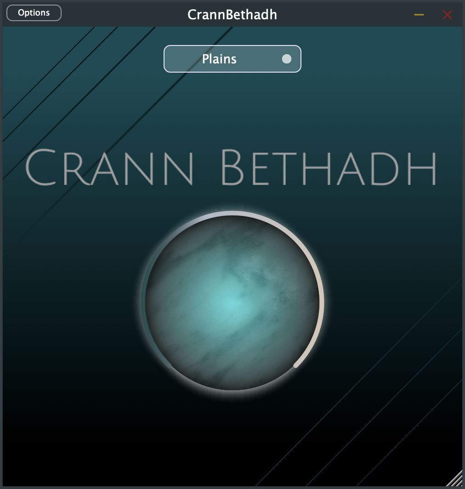

# Crann-Bethadh
## Wonderfully coloured and warm-fuzzy tails through a veil of glass and clouds

Crann Bethadh is a plugin prototype and features a convolution-based engine, incorporating some saturation processing as well. The plugin is also being oversampled internally, to avoid any harmonics being folded back into the audible frequency spectrum, creating unwanted aliasing.

The plugin has the ability the engulf the audio in a nebula of sound. With increasing intensity, the sound gets saturated, but that saturation is being washed out by the convolution cloud, creating wonderfully coloured and warm-fuzzy tails, all being perceived through a veil of glass and nebula, never sounding harsh or brittle.
 
 
Check out a demo video of [Crann Bethad](https://vimeo.com/815241746) on Vimeo!
 
 

### Disclaimer

Please note that any audio and graphical assets are not covered under the GPL-3.0 license and I can not give you permission to use them as per the license of the assets themselves. But of course you can use the logic of the code and put your own images and audio in there.
